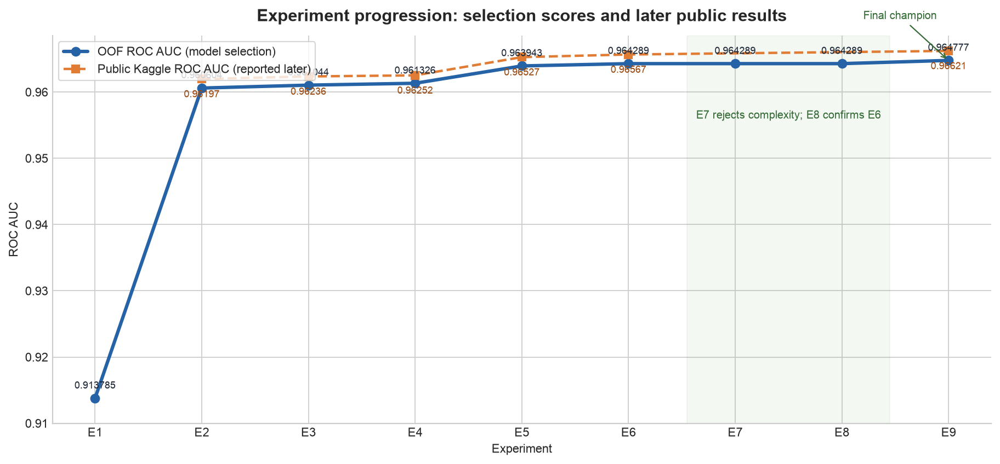

# Kaggle Playground Series S6E8 — Smartphone Addiction

This project develops a reproducible solution for a large tabular binary-classification problem. The work emphasizes controlled experiments, complete out-of-fold (OOF) predictions, and evidence-based model promotion rather than leaderboard-driven iteration.

> **Final champion: 0.964777 matched OOF ROC AUC · 0.96621 public Kaggle ROC AUC**<br>
> **Ensemble: 40% LightGBM / 60% XGBoost**, using the original predictors plus two compact screen-time contrasts.

OOF AUC is the model-selection score throughout this repository. Public leaderboard scores are reported separately and only after an experiment was complete.



## Experiment progression

| Experiment | Question answered | Promoted model | OOF AUC | Public AUC |
|---|---|---|---:|---:|
| E1 | Can a reproducible linear baseline learn useful signal? | Logistic regression | 0.913785 | — |
| E2 | Which untuned tabular family is strongest? | LightGBM; XGBoost retained for diversity | 0.960604 | 0.96197 each |
| E3 | Do LightGBM and XGBoost complement one another? | 50/50 probability blend | 0.961044 | 0.96236 |
| E4 | Do missingness or small interpretable features help? | Blend with one screen/work-study contrast | 0.961326 | 0.96252 |
| E5 | Does conservative local tuning transfer to the blend? | Tuned 50/50 blend | 0.963943 | 0.96527 |
| E6 | Have the boosters converged at 1,200 trees? | 40% LightGBM / 60% XGBoost | **0.964289** | **0.96567** |
| E7 | Can different tree families add complementary ranking signal? | No promotion; E6 retained | **0.964289** | — |
| E8 | Do the E4→E5→E6 decisions survive alternative fold assignments? | Repeated-CV confirmation; E6 retained | **0.964289** | — |
| E9 | Can targeted behavioral representations transfer across models and splits? | Add one residual screen-time contrast | **0.964777** | **0.96621** |

An em dash means no public score is recorded for that experiment. It does not represent a zero or failed submission.

## Problem

The task is binary probabilistic classification: estimate `P(addicted_label = 1)`. The official metric is ROC AUC, so performance depends on ranking positive observations above negative ones rather than selecting a single classification threshold. The positive class represents 70.94% of the training data, making accuracy alone an unhelpful selection metric.

## Dataset

- Training data: 691,369 rows × 14 columns.
- Test data: 296,302 rows × 13 columns.
- Predictors: 12 total—9 numeric and 3 low-cardinality categorical features.
- Target: `addicted_label`; identifier: `id`, which is excluded from modeling.
- Missingness: every predictor contains missing values; train/test missingness rates differ modestly.
- Integrity: no duplicate rows, duplicate IDs, or train/test ID overlap were found.

Numeric and categorical distributions are broadly similar between train and test. The largest visible shifts are in missingness, which motivated a dedicated diagnostic rather than an assumption that missing values were harmless.

## Approach

Each experiment changes one modeling dimension while holding the data split and preceding decisions fixed:

1. Establish a trivial and linear baseline.
2. Compare strong tabular model families without tuning.
3. Measure prediction diversity and test simple probability blends.
4. Diagnose feature contribution, missingness, and a small feature set.
5. Tune LightGBM and XGBoost conservatively around supported regions.
6. Test lower learning rates and longer boosting schedules with early stopping.
7. Challenge the final decisions with complementary model families and repeated CV splits.
8. Screen a bounded set of behavioral hypotheses, then confirm one frozen feature across models and split seeds.

Experiment commands generate complete OOF predictions and paired bootstrap samples locally. These large intermediates are ignored by Git; compact result tables and analysis summaries remain tracked for review.

## Feature engineering

Leave-one-feature-out ablations showed that daily and weekend screen time, notification and app-open frequency, and social-media hours made the largest marginal contributions to LightGBM. These are predictive associations, not causal effects.

Explicit missingness indicators did not improve on native tree handling. Eight conservative derived features were then evaluated individually. Only one transferred across both model families: the difference between `daily_screen_time_hours` and `work_study_hours`. The historical implementation calls this `leisure_screen_proxy`, but the available columns do not establish that the remainder is literally leisure time; “screen/work-study contrast” is the more defensible interpretation.

Combining several weakly positive ratios did not outperform this single feature, so the final feature set remains deliberately small.

E9 predeclared ten new representations after excluding E4's known failures. Only one survived the fixed cross-model screen: `daily_screen_time_hours - social_media_hours - gaming_hours - work_study_hours`. This is described as an unallocated screen-time contrast among recorded variables, not a literal measure of how the remaining time was spent. Added to E6, it improved both model families and the 40/60 blend on every confirmation seed.

## Model development

The logistic regression baseline achieved 0.913785 OOF AUC. Untuned tree ensembles produced the major step change: LightGBM and XGBoost were effectively tied near 0.9606, with HistGradientBoosting and CatBoost behind them. That near-tie motivated retaining both models rather than declaring the tiny raw difference meaningful.

Conservative tuning found broad support for more capacity and slower learning rates. Experiment 6 held tree structure fixed and extended training with fold-local early stopping:

| Final component | Learning rate | Full-data rounds | Structure held fixed | OOF AUC |
|---|---:|---:|---|---:|
| LightGBM | 0.02 | 3,808 | `num_leaves=63` | 0.963424 |
| XGBoost | 0.02 | 4,720 | `max_depth=7` | 0.963991 |

The full-data round counts are the medians of fold-best iterations. All LightGBM folds converged within their limits; one XGBoost fold remained partially cap-limited, so further rounds are a possible future diagnostic rather than a claimed completed optimization.

## Ensembling

LightGBM and XGBoost predictions are highly correlated but not identical. Their small ranking differences consistently improved AUC when probabilities were averaged. In E6, weights from 30/70 through 50/50 were nearly tied; the selected 40% LightGBM / 60% XGBoost blend achieved 0.964289 OOF AUC.

A paired 500-resample bootstrap estimated the gain over the E5 blend at +0.000347, with a 95% interval of [0.000308, 0.000387]. The broad weight plateau and paired improvement support the ensemble; the selected decimal weight should not be interpreted as a precisely optimized constant.

Experiment 8 then repeated the fixed E4, E5, and E6 configurations across five additional shuffled stratified split seeds (25 new folds). E6 beat E5 on all five seeds by a mean +0.000327 AUC; a seed-level bootstrap interval was [+0.000320, +0.000335]. The 40/60 blend also beat the predeclared 30/70 and 50/50 alternatives on every seed, although by only about 0.00002 AUC. These results strengthen the ranking of the decisions while preserving the practical conclusion that the blend-weight region is flat.

E9 kept the E6 models and blend fixed while adding one frozen feature. On a matched fixed-round seed-42 comparison, the blend increased from 0.964291 to **0.964777** (+0.000485). Across seeds 7, 21, 84, 123, and 2026, the mean paired gain was +0.000525, with 5/0/0 wins/ties/losses and a seed-bootstrap interval of [+0.000508, +0.000539]. After that local decision, E9 scored **0.96621** publicly, improving on E6's 0.96567 by **+0.00054**.

The repeated-validation estimate (+0.000525) and observed public improvement (+0.00054) are encouragingly consistent. The public leaderboard is still only one holdout, however, so this agreement is supporting external evidence—not statistical confirmation or a substitute for repeated local validation.

## Validation

Experiments E1–E7 use the same precomputed five-fold `StratifiedKFold` split with shuffling and `random_state=42`. Model scores are calculated from complete OOF probabilities, and paired bootstrap resampling is used when deciding whether a small improvement is credible.

E8 is a confirmation exercise rather than another selection loop: the fixed historical configurations were evaluated on five additional split seeds without changing features, parameters, round counts, or weights. Its uncertainty analysis treats the five seeds—not the 25 constituent folds—as the independent paired units. Five seeds remain a small sample, so the narrow interval should be read as supportive evidence under these particular repeated splits rather than a universal guarantee.

Public Kaggle scores were never used to choose features, hyperparameters, boosting schedules, or blend weights. They were recorded only after the relevant OOF decision. This separation reduces the risk of adapting the workflow to leaderboard noise and makes the local experiment history interpretable.

## What improved performance

- Moving from a linear model to gradient-boosted trees.
- Blending LightGBM and XGBoost despite their similar standalone AUCs.
- Adding one cross-model-robust screen/work-study contrast.
- Adding one predeclared residual screen-time contrast that transferred across both boosters and all confirmation seeds.
- Increasing useful tree capacity around the E4 configuration.
- Lowering learning rates while allowing more boosting rounds with early stopping.

## What did not improve performance

- Explicit missingness indicators beyond native tree missing-value handling.
- Most individual behavioral ratios and differences.
- Combining several marginally positive engineered features.
- CatBoost and HistGradientBoosting as standalone replacements for LightGBM/XGBoost.
- Fragile, fine-grained blend-weight optimization; simple weights captured the gain.
- Several regularization and shallow-tree candidates, including XGBoost depth 4.
- CatBoost and ExtraTrees diversity additions: only one isolated 5% CatBoost weight was microscopically positive, with a bootstrap interval crossing zero.
- Repeated CV did not reveal a reversal of E4→E5→E6 or a better neighboring E6 blend weight; its value was confirmation rather than a new score.
- Nine of ten targeted E9 representations failed the fixed development gate; composition shares, bounded weekend deviation, and plausible engagement interactions did not transfer strongly enough.

Negative results remain in the reports and notebooks because they constrain the next useful experiment just as much as promoted results do.

The closing sequence is intentionally conservative: E7 showed that prediction diversity alone did not justify extra ensemble complexity; E8 confirmed that E6's tuning and blend decisions survived alternative splits; E9 then promoted one hypothesis-driven feature only after it improved both components and transferred across those same confirmation seeds.

## Repository structure

```text
data/raw/                         Competition CSV files (not regenerated)
notebooks/00_project_summary.ipynb Portfolio-facing project summary
notebooks/01_reconnaissance.ipynb  Data audit and baselines
notebooks/02_model_comparison.ipynb Model-family comparison
notebooks/03_blending.ipynb         Prediction diversity and blending
notebooks/04_feature_diagnostics.ipynb Ablations and feature engineering
notebooks/05_boosting_tuning.ipynb  Conservative parameter search
notebooks/06_convergence.ipynb      Learning-rate/round convergence
notebooks/07_ensemble_diversity.ipynb Complementary-family ensemble diagnostics
notebooks/08_repeated_validation.ipynb Repeated-split robustness confirmation
notebooks/09_feature_discovery.ipynb Targeted feature discovery and cross-seed confirmation
reports/                            Tracked summary metrics and diagnostics; large caches are ignored
assets/                             Static portfolio figures used by the README
src/kaggle_smartphone_addiction/    Reusable data, CV, modeling, and submission code
submissions/                        Locally validated submission files
pyproject.toml, uv.lock             Reproducible Python environment
.github/workflows/ci.yml            Lightweight notebook validation and summary execution
```

## Reproduction/setup

The environment is managed with [uv](https://docs.astral.sh/uv/) and currently targets Python 3.13.

```bash
uv sync
uv run kaggle competitions download -c playground-series-s6e8 -p data/raw
unzip data/raw/playground-series-s6e8.zip -d data/raw
uv run jupyter lab
```

The competition data is intentionally ignored by Git. The download command requires Kaggle API credentials configured on the local machine.

The numbered notebooks can be read from saved outputs without retraining. The reusable experiment entry points are:

```bash
uv run python -m kaggle_smartphone_addiction.run_baseline
uv run compare-models
uv run evaluate-blend
uv run diagnose-features
uv run tune-boosters
uv run analyze-convergence
uv run evaluate-diversity
uv run validate-repeated-cv
uv run discover-features
```

E5–E9 are intentionally expensive; their saved reports should be used for review unless reproduction is required. Submission generation includes local schema, row-count, ID-order, missing-value, and probability-range checks. Nothing in this repository automatically submits to Kaggle.

CI validates every notebook's structure and executes only the report-driven summary notebook; it deliberately does not run modeling notebooks 01–09. The project is available under the [MIT License](LICENSE).
